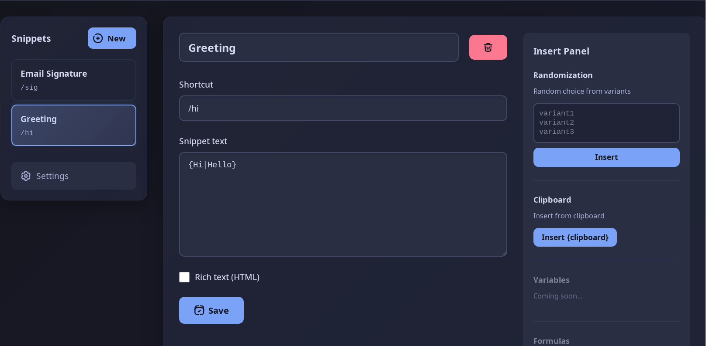

[English version → README.md](./README.md)

SnipType — это расширение для Firefox для быстрой подстановки текстовых сниппетов по шорткату.

Вы вводите `/hi` → вместо /hi вставляется заданный текст.

Почему не Text Blaze? Потому что он работает в Chrome, а не в Firefox, ничего похожего для Firefox не нашел

---

## Возможности

- [x] Подстановка текста по шорткату
- [x] Рандомизация `{вариант1|вариант2}`
- [ ] Вставка из буфера обмена
- [ ] Поддержка переменных
- [ ] Формы
- [ ] Rich text
- [ ] Исправить анимацию

---

## Установка

### 1. Временная установка (для разработки)

1. Откройте Firefox  
2. Перейдите в `about:debugging#/runtime/this-firefox`  
3. Нажмите **«Загрузить временное дополнение…»**  
4. Выберите `manifest.json`

### 2. Установка из магазина Firefox Add-ons

Установить из официального магазина:  
👉 https://addons.mozilla.org/en-US/firefox/addon/sniptype/
